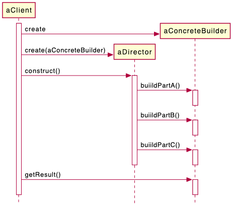
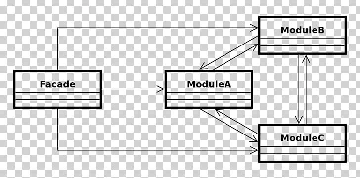
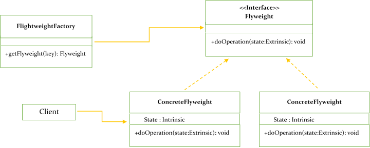
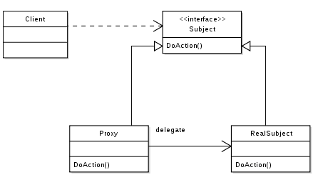

# Design-Patterns
Design patterns have been evolved over a long period of time and they provide best solutions to certain problems faced during software development. Learning these patterns helps unexperienced developers to learn software design in an easy and faster way.

## Table of Contents
1. [Creational Patterns](#creational-patterns)
   - [Factory Pattern](#factory-pattern)
   - [Abstract Factory Pattern](#abstract-factory-pattern)
   - [Singleton Pattern](#singleton-pattern)
   - [Builder Pattern](#builder-pattern)
   - [Prototype Pattern](#prototype-pattern)
2. [Structural Patterns](#structural-patterns)
   - [Adapter Pattern](#adapter-pattern)
   - [Bridge Pattern](#bridge-pattern)
   - [Composite Pattern](#composite-pattern) 
   - [Facade Pattern](#facade-pattern) 
   - [Flyweight Pattern](#flyweight-pattern)
   - [Proxy Pattern](#proxy-pattern)
3. [Behavioral Patterns](#behavioral-patterns)

# Creational Patterns
These design patterns provide a way to create objects while hiding the creation logic, rather than instantiating objects directly using new operator. This gives program more flexibility in deciding which objects need to be created for a given use case.

## Factory Pattern
"Define an interface for creating an object, but let subclasses decide which class to instantiate. The Factory method lets a class defer instantiation it uses to subclasses." ([Gang Of Four](https://en.wikipedia.org/wiki/Design_Patterns))

Deals with the problem of creating objects without having to specify the exact class of the object that will be created. This is done by creating objects by calling a factory method—either specified in an interface and implemented by child classes, or implemented in a base class and optionally overridden by derived classes—rather than by calling a constructor.

## Abstract Factory Pattern
 "Provide an interface for creating families of related or dependent objects without specifying their concrete classes." ([Gang Of Four](https://en.wikipedia.org/wiki/Design_Patterns))
 
Creating objects directly within the class that requires the objects is inflexible because it commits the class to particular objects and makes it impossible to change the instantiation later independently from (without having to change) the class. It stops the class from being reusable if other objects are required, and it makes the class hard to test because real objects cannot be replaced with mock objects.

The Abstract Factory design pattern describes how to solve such problems:
   - Encapsulate object creation in a separate (factory) object. That is, define an interface (AbstractFactory) for creating objects, and implement the interface.
   - A class delegates object creation to a factory object instead of creating objects directly

## Singleton Pattern
The key idea in this pattern is to make the class itself responsible for controlling its instantiation (that it is instantiated only once).

## Builder Pattern
It is used to great advantage with immutable classes. With them, the Builder is a mutable "helper" class that assists in the ultimate construction of the final product which is thereafter immutable.

The Builder pattern by the GoF (Gamma et al) has no build() method (as in the image below). It does say ConcreteBuilders provide an interface for retrieving the product, e.g., getResult() to return the result that was build in steps. None of the sample code in GoF uses chaining.

Example code for the classic builder pattern can be found in `creational.builder.withproductinstanceinside` package (note that it uses unusual for Kotlin C# indexer).

Many people use Builder differently than GoF. Their idea was to have directors that encapsulate all the build steps.
So, other examples of builder pattern can be found in `creational.builder.buildingproductonbuild` package:
   - Using data class for the Builder
   - Using secondary constructor with Builder as an argument
   - Using DSL
   - Using DSL and required field

## Prototype Pattern
It is used when the type of objects to create is determined by a prototypical instance, which is cloned to produce new objects.

When to use examples:
   - avoid subclasses of an object creator in the client application, like the factory method pattern does.
   - avoid the inherent cost of creating a new object in the standard way (e.g., using the 'new' keyword) when it is prohibitively expensive for a given application.

### Ways to implement:
   1. `Cloneable` interface, however, it's quite [risky](https://dev.to/lovis/gang-of-four-patterns-in-kotlin) as you need to be careful how `clone()` is implemented. 
   2. Copy constructors, helpful when we want to copy a complex object that has several fields.
   3. Kotlin's data class, it will provide a necessary copy method to avoid  expensive object creation. BUT you can't have multiple data classes implement an interface and then call clone() on objects of the Interface type (as interface doesn't have the `copy()` function). Hence, you can't use this method to "avoid subclasses of an object creator in the client application".
   4. Serialization, which requires a copied object to be `Serializable`:
      - in Java, `org.apache.commons.lang.SerializationUtils;` that provides clone() method.
      - in Kotlin, `kotlinx.serialization.Serializable` and implement clone() function manually.

### Shallow or deep copy.
   - `Cloneable` doesn't actually require deep or shallow copying. You need to take care of it yourself.
   - Copy constructors create a deep copy.
   - Kotlin's data class `copy()` is a shallow copy.
   - Serialization method gives you a deep copy of an object.

### Copy constructor vs Clone
we can also use the clone method to create an object from an existing object. However, the copy constructor has some advantages over the clone method:
- The copy constructor is much easier to implement. We do not need to implement the Cloneable interface and handle CloneNotSupportedException.
- The clone method returns a general Object reference. Therefore, we need to typecast it to the appropriate type. 
- Can not assign a value to a final field in the clone method. However, we can do so in the copy constructor.

 
# Structural Patterns

## Adapter Pattern
Allows objects with incompatible interfaces to collaborate.

The adapter design pattern solves problems like:
- How can a class be reused that does not have an interface that a client requires?
- How can classes that have incompatible interfaces work together?
- How can an alternative interface be provided for a class?

## Bridge Pattern
"Decouple an *abstraction* from its *implementation* so that the two can vary independently". ([Gang Of Four](https://en.wikipedia.org/wiki/Design_Patterns))

The *abstraction* and *implementation*  are not related to abstract classes or interfaces from programming.

The *abstraction* in the above is the name for high-level control layer for some entity. This layer doesn't do any real work on its own and delegates the work to the *implementation* layer.

## Composite Pattern
“Compose objects into tree structures to represent part-whole
hierarchies . Composite lets clients treat individual objects and
compositions of objects uniformly” ([Gang Of Four](https://en.wikipedia.org/wiki/Design_Patterns))

- In other words, implementing a Composite pattern
means creating an common base class that represents
both a part of an object, and the containing object as a
whole.
- You should consider refactoring to a Composite pattern
when data or code forms an implicit tree structure.

## Decorator Pattern
Used to decorate individual objects at run-time.
In other words, attach additional responsibilities to an object dynamically.
This pattern acts as a wrapper to existing object, not class as a whole.

## Facade Pattern
Use the facade design pattern when a system is very complex or difficult to understand because the system has many interdependent classes or because its source code is unavailable.

## Flyweight Pattern
A flyweight is an object that minimizes memory usage by sharing as much data as possible with other similar objects; it is a way to use objects in large numbers when a simple repeated representation would use an unacceptable amount of memory.

For example, in shooter video games a world can contain millions of bullets at the same type that requires a lot of memory. To reduce RAM usage, one can create a flyweight object that will hold common data (color, view) that is called *intrinsic* data and reuse it in different contexts. 

## Proxy Pattern
Provides an object that acts as a substitute for a real service object used by a client. A proxy receives client requests, does some work (access control, caching, etc.) and then passes the request to a service object.

# Behavioral Patterns
